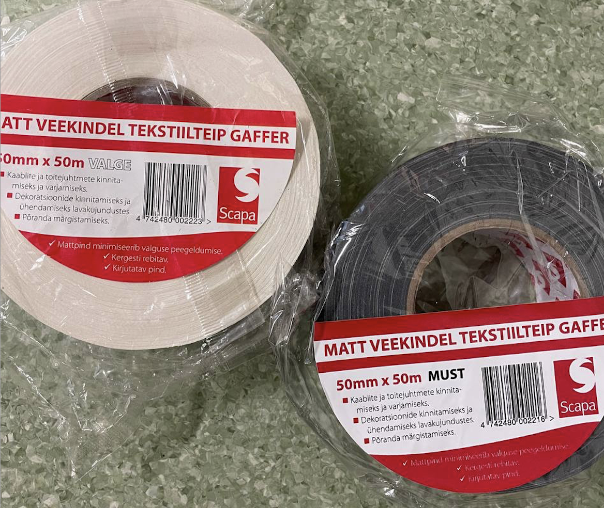
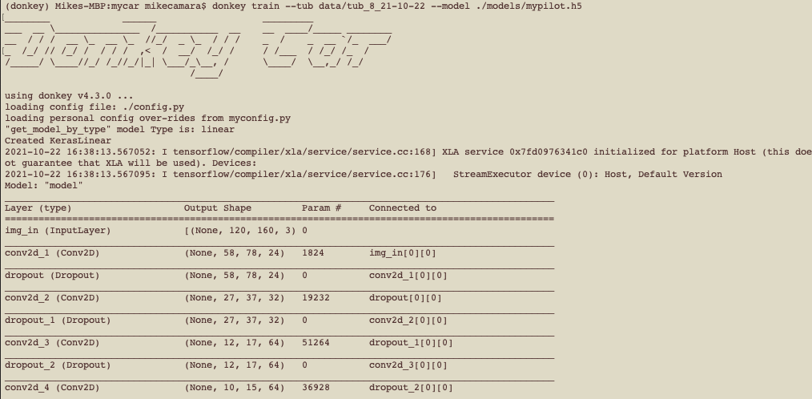

## Donkey Car Initial Setup for Mac

> By Mike Camara, supervisors: [Naveed Muhammad (PhD)](https://ee.linkedin.com/in/naveedmuhammadrobotics)  and [Ardi Tampuu (PhD)](https://ee.linkedin.com/in/ardi-tampuu-2b7595a5). Acknowledgement to [Leo Schoberwaltero (Ms)](https://github.com/schobele) for his support.


DonkeyCar is a Self Racing Car, it is also an open-source software python library that enables you to build your own self-driving scale car using artificial intelligence (AI). 

The good news is that you need to be no Elon Musk or know Machine learning (ML) to get it up and running.

The hardest part of the project is surprisingly not the AI or ML part, but the initial hardware setup. 

Even though that I had previous knowledge using Raspberry Pis and Linux, and there is an abundance of documentation scattered around the web guiding the set-up of these cars, I confess that I initially struggled a bit in different stages. 

So, if you are either a student from some school and they let you use the DonkeyCar to experiment and learn more about Machine Learning, or you are just an individual curious about self-driving cars and decided to purchase the DonkeyCar platform to get you kickstarted without reinventing the wheel, this article is for you.

I'm my case I was from the first group, I'm a student currently taking a masters degree in software engineering at the University of Tartu, and I took a [course in Autonomous Vehicles Projects](https://courses.cs.ut.ee/2021/AutVehProj/fall) and they let me borrow one of their Donkey Cars.

So I will document here all the detailed steps that you will need to take to get you up and running with the car. And I will also dive into the DonkeyCar infrastructure, explain how it works and share all the resources that helped me along the way.

Hopefully, after reading this article, you will fail less and reduce or eliminate unnecessary frustration and get to the fun of getting your car driving autonomously faster. 

# What is the DonkeyCar

DonkeyCar is both a [software](https://github.com/autorope/donkeycar) and a [hardware](https://www.robocarstore.com/products/donkey-car-starter-kit). 

First, the software is an open-source Python easy-to-use and well-documented library to create your own self-driving 1/10th scale remote control (R/C) cars. You can use the software for free and build with your own remote control car by adding some components such as a Raspberry Pi microcontroller.

Secondly, DonkeyCar [sells optimised hardware](https://www.robocarstore.com/products/donkey-car-starter-kit), including the Raspberry Pi, Camera, the remote car chassis, battery and so on, it comes all pre-assembled, which makes it so much easier. 

Finally, DonkeyCar is more than just hardware and software, is a platform to get people interested in ML by providing an awesome real-life example of an application of AI - autonomous driving.

# Brief history

Everything started in May 2016, when the Stanford engineer [Adam Conway](https://www.linkedin.com/in/adammconway/) first met the software engineer [William Roscoe](https://www.linkedin.com/in/wroscoe/) in a Self Racing Cars fair in Northern California. They were both autonomous racing cars hobbyists, and they realised that there was no easy way to get ordinary people involved in the area, because the process was much more complicated than it need to be. In an incredible plot twist, a few months later they bumped into each other again in a hackathon, and according to Adam, he was assembling his vehicle when Will approached himself to him again and asked if he could help — thus beginning the partnership that has led to the creation of the Donkey Self Racing Car.

According to Adam, it's called Donkey because like real donkeys, the donkey car is a domesticated wild animal (read AI), they’re safe for kids, they occasionally don’t follow their master’s commands, so expectations are low.


[Source](https://makezine.com/projects/build-autonomous-rc-car-raspberry-pi/)

# How it works

Once the hardware and software are all set up correctly you will run a python script that will start the training mode, which in other words, activates the car to receive commands to drive it around. 

The car is equipped with a camera and ideally, you would have set a lined track to capture images and steering angles and throttle associated with the camera images. 

The car can be controlled with a computer connected to the internet accessing the web-app localhost server, or a Play Station (PS) controller, or an Android or iOS device with the DonkeyCar app. I've tried them all and I had the best driving experience using the PS3 controller.

The mobile web page even has a live video displaying a view of what the car sees and a virtual joystick. 

The server records data every time that the joystick command is issued from the person driving the car, then uses the images recorded,  steering angles and throttle to train a Keras/TensorFlow convolutional neural network (CNN) model.

Once you are done with training the CNN, a model is outputted and it can be loaded on the car to make it drive like you, but autonomously.

# Setting up the vehicle

When you first get your box it will contain the assembled car, which consists of a remote control car chassis, an assembled Raspberry Pi, some type of battery and its charger. 

It might also come with an SD memory card, if not you will need to buy one, in terms of memory cards you will need at least 16 GB, but I recommend taking as much memory as possible, for example, my university let me borrow a car that had a 16GB memory stick, and everything was painfully slow to load because when you start to install libraries, you will need space, I've been working with 16 GB and it has been excruciating painful when I wanted to install more advanced libraries. So I bought a 164 ultra-fast memory stick for 40 Euros and I'm saving a lot of time now. 


Although not needed, I would also recommend you to get a keyboard, an HDMI cable and a mini HDMI adaptor to plug your Car on a monitor, it will save a lot of time when you are setting up the SSH and find the Raspberry Pi IP address. 

So, once you have the SD card we can start with the installation of the software.

As a reference, I used the [DonkeyCar docs website](https://docs.donkeycar.com/) to initially guide me, but I will recreate the steps below. In my case, I have a Macbook so I will guide you through the steps to using your Macbook to set the DonkeyCar app. 

The first is getting your computer ready for the DonkeyCar libraries.

Check if your computer already has Python installed, and which version of Python you have.

In your terminal type:

```js
python --version
```

You have to have at least the Python version 3.7 to make it work, but make sure you update to the latest version available. In my case, I have version 3.95.

Next, install miniconda Python according to your Python version. By the way, so you know, Conda is an open-source package management system and environment management system that runs on Windows, macOS, and Linux. [Miniconda](https://docs.conda.io/en/latest/miniconda.html) is a free minimal installer for conda.

Make sure you have git installed, but usually it is already installed on macs from the factory. 

Get the latest donkeycar from Github.

```js
git clone https://github.com/autorope/donkeycar
```

Navigate to the folder

```js
cd donkeycar
```

You are initially in a branch called dev, you will have to move to the master branch. There are some subtle differences such as the LiDAR set-up, which is outside of the scope of this article, would only work in the dev branch.

```js
git checkout master
```

Now create the Python anaconda environment

```js
conda env create -f install/envs/mac.yml
```

This will take a while because you are installing many packages, and if everything went alright you will see something like this in your terminal.


The next command is *SO IMPORTANT*, because you have to type it every time you close your terminal window to re-enable the mappings to donkey specific Python libraries.

```js
conda activate donkey
```

As soon as you type you will see the environment in your terminal changing from base to donkey


Next command 

```js
pip install -e .\[pc\]
```

The last command to set up your computer is the following. 

```js
donkey createcar --path ~/mycar
```
If everything was successful so far then you would see something like this in your terminal window. 


Now we will go ahead and install the software on the Donkeycar itself, I mean, in the Raspberry Pi embedded in the car.

Let's start by formatting the SD card and installing a fresh version of the latest Raspberry operating system Raspian Buster.

For instance, this was one place in which the DonkeyCar documentation was rather shallow, so I will try to be a bit more specific so you don't have to waste time. 

First [download the Raspian operating system](https://downloads.raspberrypi.org/raspbian_lite_latest).

Then extract the file and you will have a .img file.

Now download the software [Raspberry Pi Imager](https://www.raspberrypi.com/news/raspberry-pi-imager-imaging-utility/), once you open it, it will look like this.


Then, you first have to click to Choose the OS that you have just downloaded, then you scroll down until the last option of the menu called Use custom.


Click and select the img that you have just unzipped. 


Next, you just press the WRITE button.

If this is not the first time that you are formatting the SD card it might ask you if you would like to edit the image customization settings saved previously, it's a good idea to press edit settings because you will have the opportunity to change the name of the raspberry or even more important, to enable SSH, and configure your WIFI details in the Raspberry. You can always change it later on, but in this way, you will save time. 

This is how I set up mine.


When you are done just press the WRITE button again. Don't be afraid to remove existent data, it's good to start with a clean slate. 

If everything went okay you should see now something like this. 


Now let's insert your SD card in your Raspberry Pi and start the car, in this first run, I will connect the raspberry to a screen monitor, just to double-check that the WIFI settings are correct and the SSH is enabled.

After connecting the battery, to turn on the car, don't forget to press the button to power the car.


And make sure that the servo motor switcher is in the correct position


The raspberry pi comes with two mini HDMI ports that you can use to connect to the screen.


Therefore, you will need an HDMI cable and a mini HDMI adaptor.


After first installing Raspian, unless you set up something different the default Raspbian login credentials are:

Default Username	
```js
pi	
```

Default Password
```js
raspberry	
```

If you managed to log in to your Raspberry Pi you should see something like this:


Now let's check if the WIFI and SSH are all good.

When you log in you are directed automatically, to your user directory, in that case, the folder called "/pi". Navigate to the Linux root directory.

```js
cd ../..
```

Go to the etc/wpa_supplicant folder

```js
cd etc/wpa_supplicant 
```

and then enter the command to open the file in nano editor and check it out. 

```js
sudo nano wpa_supplicant.conf
```

If the file is empty, then it means that you will have to add your wifi configuration there:

Paste and edit this content to match your wifi, adjust as needed:

```js
country=ET
ctrl_interface=DIR=/var/run/wpa_supplicant GROUP=netdev
update_config=1

network={
    ssid="Telia-9EF5D2"
    psk="LACRAIAVENENOSA"
}

network={
     ssid="ut-public"
     key_mgmt=NONE
}
```

You can add as many wifi networks as you would like, you could also add a priority number determining which one would try to connect to first. Notice that the ut-public, from the Delta centre in Tartu, does not require entering a password. 

Save the file.

It's important to notice that with some rare exceptions (such as the ut-public from the University of Tartu), the public WIFI networks won't let you SSH into the Raspberry pi from your computer, so this won't be possible to do over the Eduroam for example unless you have your own router attached to the network, then you just have to connect both devices to the same router or same network.

Now let's check if the SSH is enabled/

From the command line enter the command

```js
sudo raspi-config
```

You should see a window like this


Go to Interface options


Go to SSH option, and then hit enter and you know should have enabled your SSH.

But to use SSH connection you first will have to reboot the system.

```js
sudo reboot
```

Now let's try to connect to the Raspberry via ssh.

Back to your Macbook terminal and enter

```js
ssh raspberrypi
```

or 

```js
ssh pi@raspberrypi.local
```


Notice that if you have not set the name of your Raspberry Pi, or set to a different name, you can always SSH into it using the pi IP address

```js
ssh pi@<your pi ip address>
```

If by any chance you get this error in regards to the authentication


Then first you will have this other command

```js
ssh-keygen -R raspberrypi
```

Type yes and hit enter

Try to ssh into the raspberry again

now it should have worked fine and you see your raspberry command line.

# Save the Raspberry Pi IP address

It's a good idea to check the Raspberry Pi IP address while you are still connected to the monitor. The easiest way to check your IP address is to enter the following command in the pi terminal

```js
hostname -I
```

It will print the IP address in the terminal


If don't have a monitor, another way to get the IP address is to ping the Raspberry Pi

```js
ping raspberrypi
```


Another way, that Ardi recommended checking the IP address is to use the free app called Net Analyzer to find the IP of your donkey car. It is available on [iOS](https://apps.apple.com/us/app/network-analyzer/id562315041) and [Android](https://play.google.com/store/apps/details?id=net.techet.netanalyzerlite.an&hl=zh_TW&gl=US). Just make sure you connect your phone to the same wifi network as the Donkey Car.


You should be able to now disconnect the DonkeyCar from the monitor and keyboard, you won't need them anymore as from now on you can connect to the car using SSH.

Another command that is good to know is that once you are connected to your Raspberry pi via SSH, to disconnect you can type.

```js
exit
```

# Installing DonkeyCar in the Raspberry Pi

## Update and Upgrade

The donkey car docs recommend we use the following two commands to update the package manager of the raspberry pi. 

```js
sudo apt-get update
sudo apt-get upgrade
```

However, these didn't fully work for me, instead, I had to use slightly different commands below.

To make sure the installation would run smoothly clean the cache

```js
sudo apt-get clean 
```

Then enter

```js
sudo apt update 
sudo apt full-upgrade
```

Make sure you install git

```js
sudo apt install git
```

## Update Raspberry configuration file

```js
sudo raspi-config
```
Enable Interfacing Options - I2C

Enable Interfacing Options - Camera

Select Advanced Options - Expand Filesystem so you can use your whole sd-card storage

Choose <Finish> and hit enter.

Note: Reboot after changing these settings. Should happen if you select yes.

## Install Dependencies

Make sure your raspberry pi has Python 3.7 or higher installed

To check just enter 

```js
python --version
```

If you see version 2.7..

Then type 

```js
python3 --version
```

If you see the 3.7 there then just need to type the following

```js
alias python=python3
```

Now python --version command will give you the latest version. 

Continue installing dependencies

```
sudo apt-get install build-essential python3 python3-dev python3-pip python3-virtualenv python3-numpy python3-picamera python3-pandas python3-rpi.gpio i2c-tools avahi-utils joystick libopenjp2-7-dev libtiff5-dev gfortran libatlas-base-dev libopenblas-dev libhdf5-serial-dev libgeos-dev git ntp
```

Optionally, install OpenCV Dependencies. If you are going for a minimal install, you can get by without these. But it can be handy to have OpenCV.

```
sudo apt-get install libilmbase-dev libopenexr-dev libgstreamer1.0-dev libjasper-dev libwebp-dev libatlas-base-dev libavcodec-dev libavformat-dev libswscale-dev libqtgui4 libqt4-test
```

Setup the virtual environment, notice that this needs to be done only once

```
python3 -m virtualenv -p python3 env --system-site-packages
```
```
echo "source env/bin/activate" >> ~/.bashrc
```
```
source ~/.bashrc
```

Your terminal should look like this now:


Modifying your .bashrc in this way will automatically enable this environment each time you log in. To return to the system python you can enter
```
deactivate
```

Get the latest Donkeycar from Github.
```
git clone https://github.com/autorope/donkeycar
```
```
cd donkeycar
```
```
git checkout master
```
```
pip install -e .[pi]
```
```
pip install numpy --upgrade
```
```
curl -sc /tmp/cookie "https://drive.google.com/uc?export=download&id=1DCfoSwlsdX9X4E3pLClE1z0fvw8tFESP" > /dev/null
```
```
CODE="$(awk '/_warning_/ {print $NF}' /tmp/cookie)"
```
```
curl -Lb /tmp/cookie "https://drive.google.com/uc?export=download&confirm=${CODE}&id=1DCfoSwlsdX9X4E3pLClE1z0fvw8tFESP" -o tensorflow-2.2.0-cp37-cp37m-linux_armv7l.whl
```
```
pip install tensorflow-2.2.0-cp37-cp37m-linux_armv7l.whl
```

You can validate your tensorflow install with
```
python -c "import tensorflow"
```
If you don't see anything after the last command then it means it is all working.

# Install OpenCV
If you've opted to install the OpenCV dependencies earlier, you can install Python OpenCV bindings now with the command

```
sudo apt install python3-opencv
```
Check if everything went okay
```
python -c "import cv2"
```

And if no errors, you have OpenCV installed.


Optionally you can install Donkey Car Console. Donkey Car console is a management software of the donkey car that provides rest-based API to support Donkey Car mobile app. This software currently supports RPI 4B only.

Download the project
```
git clone https://github.com/robocarstore/donkeycar-console
```
```
sudo mv donkeycar-console /opt
```
```
cd /opt/donkeycar-console
```

Install dependencies
```
pip install -r requirements/production.txt
```
Run the init script to set up the database
```
python manage.py migrate
```
Test the server if it is running properly
```
python manage.py runserver 0.0.0.0:8000
```
Go to http://your_pi_ip:8000/vehicle/status. If it returns something without error, it works.

Install the server as a service

```
sudo ln -s gunicorn.service /etc/systemd/system/gunicorn.service
```

## Create Donkeycar from Template
Create a set of files to control your Donkey with this command:
```
donkey createcar --path ~/mycar
```

Configure options. Look at myconfig.py in your newly created directory, ~/mycar
```
cd ~/mycar
sudo nano myconfig.py
```

Each line has a comment mark. The commented text shows the default value. When you want to make an edit to over-write the default, uncomment the line by removing the # and any spaces before the first character of the option.

Example:

```
#STEERING_LEFT_PWM = 460
```

becomes:

```
STEERING_LEFT_PWM = 500
```

This part can get be super daunting and it is crucial to make the car work, especially, with enabling the correct ports, IMU, etc, for me what work the best was to copy all the initial setup from the [Leo's DonkeyZoo project](https://github.com/schobele/donkey-zoo) and the car will just work fine.

Also, important to notice that there is two config files, the config.py and the myconfig.py, and you will have to change both. So, these files have the same commands, and the myconfig.py is where you should make the changes, as every change you make it in myconfig.py will overwrite the same command in config.py, the difference is that if you update the repository the config.py files are refactored to the original settings but the myconfig.py will remain as you set up. So it's recommended to only set up the myconfig.py, but regardless, I had to change the config.py to make it work. 

# Joystick setup

If you plan to use a Bluetooth joystick, it can become very hard and time-consuming if you try to follow the DonkeyCar documentation, so don't waste your time and follow [this blog post instead](https://pimylifeup.com/raspberry-pi-playstation-controllers)

The only different step I took from the tutorial above, was that when they tell you to get the controller MAC address by using the command "scan on", it didn't quite work for me because I could see every Bluetooth device in my entire neighbourhood, so it was impossible to discern which one belonged to the Raspberry Pi, what worked for me was instead of using the "scan on" command, when using the bluetoothctl to pair, after the "agent on" command I would enter the command "devices", and plug the controller via USB cable, that would give me the PS3 controller MAC address.


# Setting up the tracks

Theoretically, you wouldn't need to use a track, or tapes to train your car to drive well autonomously, for instance, some of my peer engineers at the University of Tartu have [successfully trained the car to drive around Delta Center rooms](https://youtu.be/Ef_q_uuLdxY), without marking the floor, in that case, the walls became the reference point. And yet another group [managed to train the car using outdoors tracks](https://medium.com/@jyrgen1k0/self-driving-car-on-a-hiking-trail-9c584ea39585) created by the nature. 

However, using a distinct colour type tape on the floor is one of the best references that you could use to train your CNN, it's so good that some people will claim that it's almost like cheating. 

Important to notice, that it does not need to be tape, it could be a long rope or a hose, I've seen people using A4 paper sheets on the floor, or even some card box or wooden walls. The path just needs to be large enough so the car can turn smoothly, mainly in the curves.

Below are some track examples.

#### The track that I built at Taltech AI Lab


My Taltech professor Juhan Ernits recommended I to use a specific type of tape, called Gaffer tape, in that way I wouldn't ruin the floors of the Taltech AI lab, this type of tape is really good because, they stick very well to the floor or walls, but they are also very easy to remove without leaving glue marks around. I've been using them to build different track shapes around the house. 



#### Track in my office room


#### Other tracks I've seen people building


[Source](https://ars.electronica.art/aeblog/en/2020/01/21/donkey-training/)


[Source](https://www.hackster.io/dhq/autonomous-driving-ai-for-donkey-car-garbage-collector-846c11)


[Source](https://youtu.be/lfwq73D7oHg) Here you see the man himself, William Roscoe, running after his DonkeyCar

# Training your model

Type the following command to start driving your car and create data for the training.

```
cd ~/mycar
python manage.py drive
```

Or if you would like to drive using the Joystick instead


```
cd ~/mycar
python manage.py drive --js
```

Training a model means to drive your car, in other words, train your "car" how to drive in that environment, the technique is called imitation learning, as the neural network will imitate the human behaviour. 

So you will be driving around the track and commands will be recorded in the server.


I would recommend you to drive at least 25k frames, because every time I tried to train the car with only 10k, the car performed poorly, however, after 25k frames recorded the car performed remarkably well. 

When you finished recording the training data you will need to transfer data from your car to your computer.

In a new terminal session on your host PC use rsync to copy your cars folder from the Raspberry Pi.

```
rsync -rv --progress --partial pi@<your_pi_ip_address>:~/mycar/data/  ~/mycar/data/
```

In my case, I could just type

```
rsync -rv --progress --partial pi@raspberrypi:~/mycar/data/  ~/mycar/data/
```

If successful you will see something like this in your terminal.


And then in your computer, inside the folder mycar/data/ you will have a folder called tub_date_and_time with all the data.

With the data in the computer you will add the command to train your neural network, just make sure you point to the correct folder, so if you are currently inside the mycar folder then type:

```
donkey train --tub data/tub_8_21-10-22 --model ./models/mypilot.h5
```

In the command above you have the function train, the input data and the output file that you will get when the training is finished. 

If everything is okay will see something like this in your terminal




Just a quick note that I could never run this last command above in my Macbook M1 ship, I think there are some compatibility issues.

I could get around by running the command in my old Macbook, but regardless, you could always run the training algorithm using [Google Colab tool](https://colab.research.google.com/github/robocarstore/donkey-car-training-on-google-colab/blob/master/Donkey_Car_Training_using_Google_Colab.ipynb#scrollTo=SCf6uTHnO4Lh), which would be faster as well.

Just, if you were wondering, this was the issue I was having with the Macbook M1 ship, some sort of illegal hardware instruction, which I couldn't fix.


# Drive autonomously

That's the moment of truth and the most exciting part, to get your car self-driving. 

If everything went well so far you have now a brand new model ready to drive your car. It will be inside the folder models and it will be called mypilot.h5.

You will now have to transfer this model back to the Raspberry Pi, so make sure your car is on and type the following command in your computer:

```
rsync -rv --progress --partial ~/mycar/models/ pi@raspberrypi:~/mycar/models/
```

If everything went fine you would see something like this.


Wow, done! You are almost there, so close.

There is one last step to take now which is to run the model in the car. 

So, from your raspberry console type:

```
python manage.py drive --model ~/mycar/models/mypilot.h5
```

In the terminal, you will see something like this


Now, the very last step. Go to a computer browser, type "raspberrypi:8887" to open the web-app interface, and then make sure that the Mode & Pilot selected is Local Pilot (d) and press the green button to Start the Vehicle


Voilà!

Your car should be driving autonomously now.

Whaaaat? Was this a "meh" moment?

The car is crashing around and not performing as you expected? 

Okay, no panic, we can improve that, let's take a look at the next section about driving better. 

# Driving better

There are two important aspects to observe if would like your autonomous car to drive better.

First is the way you train your car, in terms of how good can you drive your car. Here is where is the famous saying "garbage in, garbage out" comes into place. If you train your car hitting walls, or derailing from the track, then your car will learn to do these bad things. So, you should make sure you clean the data carefully, by only exposing the model for the good pilot that you are. Make sure to delete all random garbage images from the dataset. You can use the donkey UI tools for that. You can clean the data by using the web-app provided interface, or by clicking the triangle button of the joystick every time you crash, so it would erase the last 150 frames. 

Secondly, is related to how the machine learning model is trained. The DonkeyCar platform provides you with multiple different ML architectures that you could use [to train your model](https://docs.donkeycar.com/guide/train_autopilot/#how-to-train-a-behavior-model). Or if are a ML savvy you could even [create your own architecture](https://ori.codes/artificial-intelligence/custom-architecture). 

Finally, don't forget to collect enough data, it can be tedious to keep driving your car around, however, I've experienced that the car will need at least 20k frames to start to perform acceptably.

One of the most active collaborators of the DonkeyProject is [Tawn Kramer](https://twitter.com/tawnkramer), he created an [open-source simulation environment](https://github.com/tawnkramer/gym-donkeycar) that could be used to train reinforcement learning models.

In [this video](https://www.youtube.com/watch?v=4fXbDf_QWM4) he provides tips on how to drive and steer your vehicle for better training. 

But from my own experience and from what I've heard from my peer engineers was that to train your model well you would have to see where it fails, collect more data of those turns, retrain the model with a bigger dataset containing additional data.

Furthermore, if you have trained your car in your track and would like to train in a different place, mixing the data can be difficult and lead to bad results.

# Videos of my car driving autonomously

#### Video of my auto-pilot trained with 25k frames (The good)
With enough data the car performance was outstanding. 
<iframe width="560" height="315" src="https://www.youtube.com/embed/2cdkh3g9h4E" title="YouTube video player" frameborder="0" allow="accelerometer; autoplay; clipboard-write; encrypted-media; gyroscope; picture-in-picture" allowfullscreen></iframe>

#### Video of my auto-pilot trained with less data 10k frames (The bad)
Not enough data results in poor self-driving performance.
<iframe width="560" height="315" src="https://www.youtube.com/embed/qI9nAUcKCjI" title="YouTube video player" frameborder="0" allow="accelerometer; autoplay; clipboard-write; encrypted-media; gyroscope; picture-in-picture" allowfullscreen></iframe>

#### Video of my auto-pilot failing miserably (The ugly)
In the Delta track, my mistake was to train the model with too little data and I also tried to train the car to drive into random intersections, while I should have driven it in rounded loops. 
<iframe width="560" height="315" src="https://www.youtube.com/embed/lMp_M5dhUUA" title="YouTube video player" frameborder="0" allow="accelerometer; autoplay; clipboard-write; encrypted-media; gyroscope; picture-in-picture" allowfullscreen></iframe>

# Resources that I wish I knew before

[Donkey Car Initial Setup for Windows](https://handykurniawan.medium.com/donkey-car-initial-setup-for-windows-edfe622f58c4)

[Implementing Network Lag for Keras Linear with DonkeyCar](https://handykurniawan.medium.com/implementing-network-lag-for-keras-linear-with-donkeycar-43fd726c2afe)

[Step-by-step tutorial how to build an Autonomous R/C Car with Raspberry Pi from scratch By the DonkeyCar creators Adam Conway and William Roscoe](https://makezine.com/projects/build-autonomous-rc-car-raspberry-pi)

[Leo Schoberwalter donkey-zoo repository with optimised myconfig.py and config.py settings](https://github.com/schobele/donkey-zoo)

[Train your model using Google Colab](https://colab.research.google.com/github/robocarstore/donkey-car-training-on-google-colab/blob/master/Donkey_Car_Training_using_Google_Colab.ipynb#scrollTo=SCf6uTHnO4Lh)

[Setup a Bluetooth remote controller with a Raspberry PI](https://pimylifeup.com/raspberry-pi-playstation-controllers/)

[Self-Driving car on a Hiking Trail](https://medium.com/@jyrgen1k0/self-driving-car-on-a-hiking-trail-9c584ea39585)

[Buy a brand new assembled DonkeyCar](https://www.robocarstore.com/products/donkey-car-starter-kit)

[GitHub list of DonkeyCar public repositories](https://github.com/topics/donkey-car)

[How to convert a remote-controlled car into a Donkey Car](https://ars.electronica.art/aeblog/en/2020/01/21/donkey-training/)

[OpenAI Gym Environments for Donkey Car](https://github.com/tawnkramer/gym-donkeycar)

[Driving Tips to Train your Autonomous End-to-End NN Driver](https://www.youtube.com/watch?v=4fXbDf_QWM4)

[DonkeyCar Mobile app](https://docs.donkeycar.com/guide/mobile_app/)

[DonkeyCar official website](https://www.donkeycar.com/)

[DonkeyCar docs website](https://docs.donkeycar.com/)

[What is the DonkeyCar in simple words](https://clinq.ai/blog/donkey-car/)

[Use a TensorFlow SSD MobileNetV2 DNN on the Raspberry Pi plus Pi Camera to build an autonomous car capable of object detection](https://www.hackster.io/dhq/autonomous-driving-ai-for-donkey-car-garbage-collector-846c11)

[Create a custom Neural Network Architecture for the DonkeyCar](https://ori.codes/artificial-intelligence/custom-architecture/)

[How do the architectures that come with Donkey work?](https://ori.codes/artificial-intelligence/custom-architecture/)

[How the DonkeyCar works review file by file](https://github.com/andrew-houghton/self-driving-donkey-car/blob/master/docs/how-it-works.md)

[Keras script responsible for training your model](https://github.com/autorope/donkeycar/blob/dev/donkeycar/parts/keras.py)

[A detailed report of building a DonkeyCar from scratch](https://robocaresslingen.github.io/BookDownDocu/donkeyCar.html)

[DonkeyCar training keras-vis](https://www.youtube.com/watch?v=80VDROjCIMg)

[How to train an autopilot with Keras - Using Donkey car](https://www.youtube.com/watch?v=mZnPW0W_7ug)

[End-to-End Deep Learning for Self-Driving Cars](https://developer.nvidia.com/blog/deep-learning-self-driving-cars)

[Donkeycar SageMaker Workshop - workshop designed for anyone who is interested in building self-driving cars using Amazon SageMaker](https://github.com/chankh/donkeycar-sagemaker)

[Official DonkeyCar GitHub repository](https://github.com/autorope/donkeycar)

[Learning to Drive Smoothly in Minutes using a reinforcement learning algorithm](https://github.com/araffin/learning-to-drive-in-5-minutes)

[Applying Deep Learning to Autonomous Driving](https://mushr.io/tutorials/deep_learning/)

[Build a Self-driving Car in Two Days and Learn about Deep Learning — Part 1](https://medium.com/@jasonwu_49390/how-to-build-a-self-driving-car-in-two-days-and-learn-about-deep-learning-8b8826baad4b)

[Donkey Car Project Part 2: Data Analysis](https://medium.com/@jasonwu_49390/donkey-car-project-part-2-data-analysis-e9c5ef947c2f)

[Donkey Car Part 3: Neural Net — Improving Accuracy and Inference Speed on Raspberry Pi](https://medium.com/@jasonwu_49390/donkey-car-part-3-neural-net-1f9b7ea939c)

[DeltaX Self-driving competition page](https://courses.cs.ut.ee/t/Deltaxselfdriving)

[Delta X Self-Driving Competition 2022 Rules](https://docs.google.com/document/d/1hNO116sME1Y_EnM3FTmpQ3kLsaFcrniUx-wV5IJbTYI/edit)

[Ardi's instructions on how to set up the car](https://docs.google.com/document/d/1upTCGdQOzpTfSG8RDlGXRGKYrIKDtmzoNA4BBIG1DRs/edit)

[Autonomous toy car platform for projects and student competitions](https://drive.google.com/file/d/1AAYrcHJbYmfYYfqnQrA1XiAj7MjG6rEb/view?usp=sharing)

[Protocol for charging batteries](https://docs.google.com/document/d/1yZUDXRPfiMDcur6Y_iA8aW6kc8eNb8RgpQzZqgKSVEM/edit)

[Battery usage rules](https://docs.google.com/document/d/1o6n-7F6W0rRn_MoEbvBqaT4EecF9pHhGiA4II7Runp4/edit)

# Interesting related publications

[DeepPicar: A Low-cost Deep Neural Network-based Autonomous Car](https://arxiv.org/pdf/1712.08644.pdf)

[Explaining How a Deep Neural Network Trained with End-to-End Learning Steers a Car](https://arxiv.org/pdf/1704.07911.pdf)

[Implementation of the above paper with the DonkeyCar](https://github.com/nikkkkhil/self-driving-car-implementaion-based-on-nvidia-paper-using-keras)

[Self-driving scale car trained by Deep reinforcement Learning](https://arxiv.org/pdf/1909.03467.pdf)

[Training Neural Networks to Pilot Autonomous Scaled Vehicles](https://digitalcommons.bard.edu/cgi/viewcontent.cgi?article=1222&context=senproj_s2018)

[Optimizing Deep-Neural-Network-Driven Autonomous Race Car Using Image Scaling](https://www.shs-conferences.org/articles/shsconf/pdf/2020/05/shsconf_etltc2020_04002.pdf)

