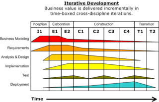

This post was inspired by the [Ian Sommerville book, Software Engineering](https://www.amazon.com/Software-Engineering-10th-Ian-Sommerville/dp/0133943038).

Software processes are a set of activities for software production. It involves software specification, software development, software validation and software evolution.

Processes are like cake recipes, different cakes, different ingredients, safety-critical systems will require a very structured development process. Enterprise systems might need to evolve requirements rapidly, and would require a more flexible agile process. 

## Software process models

A software process model is also called Software Development Life Cycle or SDLC model or sometimes process paradigms, it's a high-level, abstract description of the software processes and approaches to developing software. 

There are different tastes of SDLC available including:

* **The waterfall model** -  projects are divided into separate phases Requirements Specification > Development and Software Desing > Validation and Testing > Evolution. This approach is recommended when it is needed to build a system that has strong requirements which are real-time safety-critical or embedded applications which later changes in requirements would lead to an increase of cost and time. 

* **Incremental development** - as the name suggests the software is built incrementally in iteration cycles that would ideally deliver at each iteration a usable, tested version of the product, sometimes called the Minimum Viable Product (MVP). In each cycle, requirements might change and the system would add functionalities to the previous version. This approach is recommended for companies like startups that are still trying to establish a business model or fields that evolve very fast such as mobile app development. 

* **Integration and configuration** - this approach will build software relying on reusable components already available. The focus is to configure and integrate the system according to a set of requirements. This reduces costs while also reducing the customization level of the product. Ideal for cases when you need to get a prototype up and running to evaluate a product before creating your own software. 

There are some attempts of creating a "universal" software process to develop software, and one of the best ones is called the Rational Unified Process RUB (Krutchen 2003)

[Image source](https://www.google.com/url?sa=i&url=https%3A%2F%2Fen.wikipedia.org%2Fwiki%2FRational_Unified_Process&psig=AOvVaw1Mg7VQyikW-ut__JPlZnFu&ust=1635676468569000&source=images&cd=vfe&ved=0CAsQjRxqFwoTCLjwkuv38fMCFQAAAAAdAAAAABAD)

## Process activities

This relates to the activities inside each phase of the models described above.

### Software specification

This is the part that we need to be able to talk sometimes to non-technical audiences, but experts in their crafts to gather the requirements of the system.

Requirements engineering is a critical stage as if mistakes here will cause a snowball effect causing problems later during design and implementation. 

The system requirements must be listed in a document that is agreed upon and satisfies the stakeholder requirements. There are two levels of details, first a high level of specifications aimed at end-users and customers, then a more specific and detailed set of requirements aimed at the system developers. The entire process is divided into three main activities:
* Requirements elicitation and analysis
* Requirements specification
* Requirements validation

### Software design and implementation

At this stage an executable software application will be conceived, built and matured. Based on the requirements a team of developers will take care of turning an idea into a reality. 

They are four activities in this stage:

* Architectural design - identify the overall infrastructure of the system, the components, modules, subsystems, their interaction. Usually, the output of this stage is a number of diagrams that explain how and where the system will be built and maintained.

* Database design - the requirements will give clues about which data need to be stored and processed, this stage might be done in association with the next stage. 

* Interface design - the developers will build user interface (UI) structures that enable users to interact with the system.

* Component selection and design - this stage include the search of reusable components that could be integrated with the system, but also if not available, here we will design and develop such functionalities.

### Software validation

Read software testing. Here it is ensured that the requirements are individually tested and validated. 

The stage consist of four areas:

* Component testing - this is when the developer writes tests the validate the system functions and evaluate the interaction between inputs and outputs of the system. Test-Driven Development(TDD) is an approach to coding in which developers first write a test that fails, and then implement the function to fix it making the test pass. TDD is widely used in the industry. Every line of code should have a specific use for a certain function, and this should be tested, so ideally, the codebase would have 100% component testing coverage. 

* System testing - this type of test will evaluate the performance of the system as a whole, the entire application infrastructure and integrated systems together. 

* Customer testing - it is when you deploy the software system to a particular number of user that will interact with the system and test it. A famous customer testing approach is the A/B Testing in which different versions of the software are released to different sets of groups and then the performance of the different systems is evaluated and compared. 

### Software evolution

The processes in this stage are related to evolving the software as it lives through it is life cycle. For instance, software usually has licences that need to be updated, or libraries that became deprecated, or even when the hardware, such as phones evolve the software has to evolve along or is at the risk of dying. 

## Changes are inevitable

Technology is progressing faster than ever, the requirements will change, the hardware will change and software engineers must be ready to cope with change. 

Expecting changes and embracing them is already a good starting point. Two approaches to deal with the change, which are anticipation and change tolerance. In that case, prototyping and incremental delivery are good tools to deal with change.

## Process improvement

This is an enormous area of software engineering and there are many schools of thought, nevertheless, I will try to sum it up in one sentence. 

This stage means measuring, analysing and if necessary changing to optimize the processes involved during the entirety of the SDLC. 